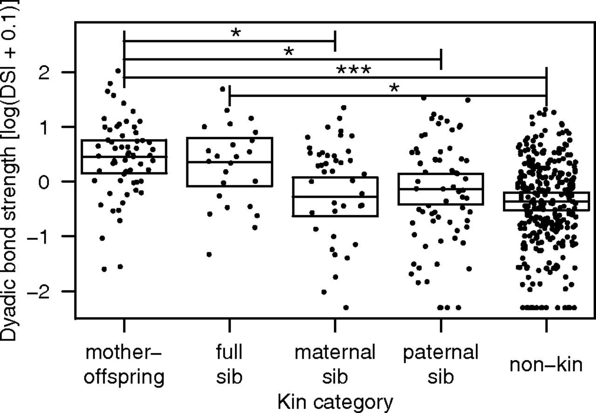

```{r setup, include=FALSE}
knitr::opts_chunk$set(echo = TRUE)
```    
Hi reader,

I am about to walk you through a paper entitled Female sociality and sexual conflict shape offspring survival in a Neotropical primate by Kalbitzer et al. (2017).  The reason I chose this paper is because it is a study of the Capuchin monkeys who made me fall in love with primatology.  On the particularly hard days, they are what remind me why I am here.
 
.JPG)

Before we begin, lets install the following packages: **lme4**, **ggplot2**, **dplyr**

I have included the code to download these packages bellow:
```{r, eval=FALSE}
#Here is the code to install lme4. 
install.packages("lme4",
   repos=c("http://lme4.r-forge.r-project.org/repos",
      getOption("repos")[["CRAN"]]))
```
 
```{r, eval=FALSE}
#Here is the code to install ggplot2, ggsignif and dplyr.
install.packages("tidyverse")
install.packages("ggplot2")
install.packages("ggsignif")
install.packages("dplyr")
```

# **A Brief Introduction**

In a 2017 paper by Kalbitzer et al., researchers studying wild white-faced Capuchin monkeys living in Santa Rosa, Costa Rica set out to answer the question "what is the relationship between female sociality, offspring survival, and infanticide risk"?

Their study is based upon the knowledge that most mammalian species live in social groups and they may vary in degrees of sociality, which yield differential fitness.  A few studies published prior to this one argued that female sociality has a positive impact on infant survival.  However, no studies looked at the role that male reproductive strategies, notably infanticide, might influence the effects that female sociality has on infant survival. 

We know that the reproductive strategies of males and females differ and that this may result in sexual conflict.  We know too that infanticide significantly increases during periods of alpha male replacements. 

In the tables and figures that follow, I will illustrate some of the key findings from their work:
 
1. Offspring of highly social and high ranking females had higher survivorship during *stable* periods.

2. Offspring of highly social and high ranking females were more likely to die/disappear during periods of alpha male replacements.

  + This is likely because new alpha males move to the center of the group, where highly social females are located. 
  
**Therefore** it is clear that female sociality may sometimes have negative fitness consequences due to male behavior.

# **Working with the Data**
We begin by downloading the data, so that we may work with it.  The authors of this paper put two excel sheets onto [this webpage](https://datadryad.org/stash/dataset/doi:10.5061%2Fdryad.93463).  Only one of them will be relevant to this project. 
```{r - Download Data,message=FALSE,warning=FALSE}
library(curl)
f <- curl("https://raw.githubusercontent.com/ZoeEAlbert/zalbert-data-replication-assignment/main/Kalbitzer_et_al_capuchin_sociality_dyadic_data.csv")
d <- read.csv(f, header = TRUE, sep = ",", stringsAsFactors = FALSE)
head(d) #This will help us see the top 6 lines of every row. 
names(d) #Having the names spelled out like this will help us with our model later!
#For future reference, remember that we are calling our data 'd'.
```

Female social bonds vary between and within dyads.  The coefficient of variation was **86%** between dyads and **67%** within the same dyad over time.  The variation in bond strength *both within and between* dyads is significantly related to three of the tested variables;

1. Relatedness (R-Value)

2. Dominance rank difference

3. Presence of female infants 

## ***Predictors of Dyadic Bond Strength*** 

The first thing we are going to do is replicate the first table in the paper.  Table 1 illustrates the following predictors of dyadic bond strength: R-value, Age difference, Rank difference, Male infant present, Female infant present.

I started by putting the data into a data frame so I could get a better look at it in r. 
```{r - Table 1. Predictors of Dyadic Bond Strength, message=FALSE, warning=FALSE}

df <-read.delim2("https://raw.githubusercontent.com/ZoeEAlbert/zalbert-data-replication-assignment/main/Kalbitzer_et_al_capuchin_sociality_dyadic_data.csv") #Let's first get our data into a data frame.

library(lme4) #Now, let's go to the library to get the package (lme4) that we need. 
```

lme4 <- lmer(data = df, DSI ~ Intercept + RValue_Dyad + AgeDifference_years_Dyad )

summary(lme)

coefficients(lme)

full <- lmer(data = d, duration ~ reprocondition + parity + (1 + reprocondition |
    subject) + (1 + parity | subject), REML = FALSE)

reduced <- lmer(data = d, duration ~ parity + (1 + reprocondition | subject) +
    (1 + parity | subject), REML = FALSE)

anova(reduced, full, test = "Chisq")

As a point of reference, here is what it should look like, based upon the paper.  


## ***Dyadic bond strength among different kin categories***

The next thing that I wanted to replicate was the first figure from the paper.  This figure shows the dyadic bond strength of each of five kinship categories (mother-offspring, full sib, maternal sib, paternal sib, non-kin).
```{r - Figure 1.baseplot}
#First, let's try using baseplot. 
str(d)
d[8]<-as.factor(d$KinshipCategory_Dyad)
DSI<- log(d$DSI+.1)
plot(d$KinshipCategory_Dyad, log(d$DSI+.1))
#After some trial and error, I learned that I could add the log and .1 in r, and don't have to go back to excel to do so.  I appreciate that a lot. 
```

This looks okay, but I think we can make it look better!

```{r - Figure 1.ggplot, message=FALSE,warning=FALSE}
#Next, let's try the same thing but with ggplot to make things a bit more fanciful, and true to the published paper.  By using this package, we are able to add boxes, points, themes and more.  
library(ggplot2) #Let's invite ggplot to the party. 
library(ggsignif)
levels(d$KinshipCategory_Dyad) #The levels function will make sure that my categories can appear in the order I want them to. 
d$KinshipCategory_Dyad <-factor(d$KinshipCategory_Dyad, levels = c( "mother-offspring", "full sib", "maternal sib", "paternal sib", "non-kin", "Excluded from model testing for effect of kinship categories" )) #I have to list the categories as they appear on the excel document. 
levels(d$KinshipCategory_Dyad)
#Please note that after running this code, my kinship categories were not in the same order as they appear in the presented figure.  To fix the order, I used the levels function.
ggplot(data = d, mapping = aes(x = KinshipCategory_Dyad, y = log(d$DSI+.1)))+geom_boxplot(data = d)+geom_jitter(data=d)+theme_bw()+ geom_signif(comparisons = list("mother-offspring", "full sib", "maternal sib", "paternal sib", "non-kin", "Excluded from model testing for effect of kinship categories"), map_signif_level=TRUE)
#I found geom_jitter online and it worked to make sure my points didn't just show up in a straight line!
#Now, we have one extra category.  We should get rid of it. We also, still want to add the significance.  I have tried many different means of doing this.  And, I am unable to. 
```
  
The graph that we produced looks pretty good compared to the graph that the author's submitted. 

## ***Rank of a Group, Measured Over Years***

This graph, which is one of six, shows the rank of individuals in group one over the time span: 2005-2011.

```{r - Figure S5. data and baseplot}
#Because the data on dyad was incomplete, I first had to do some data manipulation.  And boy are my arms tired. 
group1<- subset(d, Group_ID == 1)
group1
View(group1)
group1A<-group1[1:5]
group1B<-group1[10:11]
group1<-cbind(group1A, group1B)
ID<-group1[3, 5:6]
View(ID)
ID1<-group1[3]
ID2<-group1[5:6]
ID<-cbind(ID1, ID2)
View(ID)
ID1<-group1[c(1:20),]
View(ID1)
ID1<-ID1[4:5]
ID1<-group1[c(1:20),]
ID2<-ID1[4:5]
ID3<-ID1[7]
ID1<-cbind(ID1, ID2)
ID1<-cbind(ID2, ID3)
cols<-c("ID", "Year","Rank")
colnames(ID)<-cols
colnames(ID1)<-cols
group1_r<-rbind(ID, ID1)
View(group1_r)

#Next, let's try plotting this by using base plot.

plot(group1_r$Year, group1_r$Rank)
plot(group1_r$Year, group1_r$Rank, pch = 19, 
     col=c("red", "blue", "green", "orange", "purple", "pink", "black", "brown", "grey", "yellow", "red"),xlab = "x", ylab = "y")
# Add a legend to the plot.
legend("topright", legend=c("1", "2", "8", "11", "18", "26", "27", "28", "29", "30", "32"),
       col=c("red", "blue", "green", "orange", "purple", "pink", "black", "brown", "grey", "yellow", "red"), lty = 1:2, cex=0.8) 
#I wanted to differentiate the points at first, so I began with color.
#This is clearly not great. BOOOOOOOO.  There is no good way to do a line here.  Let's do ggplot instead.
```

```{r - Figure S5. ggplot}
#Lets try ggplot instead, which we can get to by opening up tidyverse.
library(tidyverse)
ggplot(data = group1_r, mapping = aes(Year, Rank,group=ID))+  geom_line(aes(linetype=as.character(ID)), color="black", size=1.2)+
  geom_point(aes(shape=as.character(ID)),size=3)
#scale_shape_manual with the following numbers could make the data points exact: 0:1:2:4:5:6:15:16:17:1:0.
#ggplot you are a beautiful, beautiful little baby!
```


In conclusion, 

As much as I love these Capuchin monkeys, this was the second paper that I choose and it was incredibly difficult to replicate. There were certain aspects that were not well defined and/or organized.  I don't understand why some of the calculations were not saved in the excel file.  Obviously they had to do more work on r because of this (and it also made it much more difficult to replicate).  Additionally, it was not always clear what variables they used in the LMMs.
Truly this is one of the most difficult, frustrating, rewarding courses I have ever taken.  Am I amazing at stats or coding?  No.  Am I working my butt off and excited to continue to? Yes. 